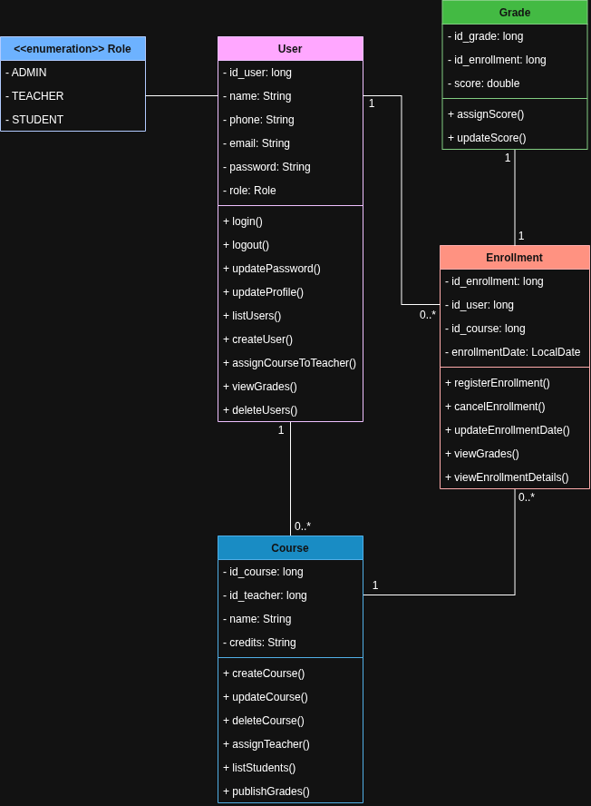
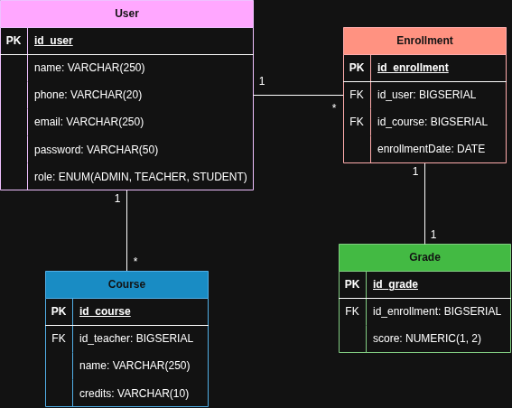

# 🚀 Sistema Académico Riwi CodeUp (Spring Boot)

Bienvenido al repositorio del **Sistema Académico Riwi CodeUp**, una aplicación **backend profesional** para la gestión de **estudiantes, cursos y calificaciones**, desarrollada con **Spring Boot** y principios de **arquitectura limpia**, **DTOs** y **manejo de excepciones personalizado**.

---

## 🎯 Objetivos del Proyecto

Desarrollar una aplicación web sólida basada en **Spring Framework**, aplicando buenas prácticas de ingeniería de software, arquitectura por capas y un diseño REST limpio.

**Objetivos principales:**
- Aplicar separación de responsabilidades entre **Controller**, **Service** y **Repository**.
- Implementar **DTOs** para desacoplar las entidades del modelo.
- Integrar **Spring Data JPA** para la persistencia con **PostgreSQL**.
- Manejar errores de forma profesional mediante **excepciones personalizadas**.
- Documentar la API con **Swagger (OpenAPI)**.

---

## ✨ Características Implementadas

### 👥 Gestión de Usuarios

**Autenticación:**
- `POST /api/users/login` → Validar credenciales de usuario (usando DTOs).

**CRUD de Usuarios:**
- `POST /api/users` → Crear un nuevo usuario (ADMIN, TEACHER, STUDENT).
- `GET /api/users` → Listar todos los usuarios.
- `GET /api/users/role/{role}` → Listar usuarios filtrados por rol.
- `PUT /api/users/{id}/profile` → Actualizar perfil (nombre, teléfono) de un usuario.
- `PUT /api/users/{id}/password` → Cambiar contraseña de forma segura.
- `DELETE /api/users/{id}` → Eliminar un usuario.

**Roles definidos:**
- **ADMIN** → Puede crear, listar, asignar y eliminar usuarios.
- **TEACHER** → Puede listar y gestionar estudiantes en sus cursos.
- **STUDENT** → Puede consultar su perfil y calificaciones.

### 📚 Gestión de Cursos

**CRUD de Cursos:**
- `POST /api/courses` → Crear un nuevo curso.
- `GET /api/courses` → Listar todos los cursos.
- `GET /api/courses/{id}` → Obtener un curso por su ID.
- `PUT /api/courses/{id}/` → Actualizar un curso.
- `DELETE /api/courses/{id}` → Eliminar un curso.

**Asignación de Docentes:**
- `PATCH /api/courses/{id_course}/assign-teacher` → Asignar un profesor a un curso.

**Reglas:**

- Solo **ADMIN** puede crear y asignar profesor.
- Los **TEACHER** solo pueden ver sus cursos (si está implementado).
- Los **STUDENT** pueden visualizar cursos disponibles (si está implementado).

---

## ⚙️ Tecnologías Utilizadas

| Componente | Tecnología |
|-------------|-------------|
| **Framework principal** | Spring Boot 3.x |
| **Lenguaje** | Java 21 |
| **Persistencia** | Spring Data JPA |
| **Base de datos** | PostgreSQL (Supabase) |
| **API REST** | Spring Web |
| **Documentación** | Springdoc OpenAPI (Swagger UI) |
| **Utilidades** | Lombok |
| **Build Tool** | Maven |

---

## 🏗️ Arquitectura del Sistema

El proyecto sigue una **Arquitectura por Capas**, con responsabilidades claramente separadas:

```
com.CAV_RIWI_codeUp.academic_system
├── controller/                             → Controladores REST (manejan las peticiones HTTP)
│   ├── UserController.java
│   └── CourseController.java
├── service/                                → Lógica de negocio y validaciones
│   ├── UserService.java
│   └── CourseService.java
├── repository/                             → Acceso a datos (interfaces JPA)
│   ├── UserRepository.java
│   └── CourseRepository.java
├── model/                                  → Entidades JPA (representan las tablas)
│   ├── User.java
│   ├── Role.java
│   └── Course.java
├── dto/                                    → Objetos de transferencia de datos (entradas/salidas)
│   ├── user/
│   │   ├── LoginRequest.java
│   │   ├── CreateUserRequest.java
│   │   ├── UpdateProfileRequest.java
│   │   ├── UpdatePasswordRequest.java
│   │   └── UserResponse.java
│   └── course/
│       ├── CreateCourseRequest.java
│       ├── UpdateCourseRequest.java
│       └── AssignTeacherRequest.java
├── exceptions/                             → Excepciones personalizadas
│   ├── ResourceNotFoundException.java
│   └── BadRequestException.java
└── config/                                 → Configuraciones del proyecto (Swagger, seguridad, etc.)
```

---

## 🧩 Flujo de Capas

```
Controller → Service → Repository → Database
      ↑
      └── DTOs ↔ Entidades
```

---

## ⚠️ Manejo de Errores

**Excepciones Personalizadas:**
- `ResourceNotFoundException` → Retorna HTTP 404 si no se encuentra un recurso.
- `BadRequestException` → Retorna HTTP 400 para validaciones fallidas.

**Ejemplo de respuesta de error:**
```json
{
  "timestamp": "2025-11-07T12:34:56",
  "status": 404,
  "error": "Resource Not Found",
  "message": "User not found with id 10"
}
```

---

## 📊 Modelo de Datos

A continuación se presenta el modelo conceptual (UML) y el esquema físico (Entidad-Relación) que definen la arquitectura de la base de datos.

### Diagrama de Clases (UML)
Este diagrama muestra las clases de la aplicación, sus atributos, métodos y las relaciones entre ellas.



### Diagrama Entidad-Relación (ER)
Este diagrama muestra la estructura de las tablas en la base de datos PostgreSQL, incluyendo claves primarias (PK) y foráneas (FK).



### 🧑‍🎓 Tabla `users`
| Campo | Tipo | Descripción |
|--------|------|-------------|
| `id_user` | Long | Identificador único |
| `name` | String | Nombre del usuario |
| `email` | String | Correo electrónico (único) |
| `password` | String | Contraseña cifrada |
| `phone` | String | Teléfono |
| `role` | Enum (`ADMIN`, `TEACHER`, `STUDENT`) | Rol del usuario |


### 📘 Tabla `course`
| Campo | Tipo                                 | Descripción                |
|--------|--------------------------------------|----------------------------|
| `id_course` | Long                                 | Identificador único        |
| `name` | String                               | Nombre del curso           |
| `credits` | String                               | Créditos |
| `id_teacher` | FK `users.id_user`                   | Profesor asignado         |

---

## 📖 Documentación de la API

La documentación interactiva se genera automáticamente con **Swagger UI**.

🔗 **URL:** [http://localhost:8080/swagger-ui.html](http://localhost:8080/swagger-ui.html)

---

## 🧰 Cómo Ejecutar el Proyecto

### 🔹 Prerrequisitos
- Java **JDK 21**
- Apache **Maven**
- Base de datos **PostgreSQL** (puede ser en Supabase o local)

### 🔹 Instalación

1. **Clona el repositorio:**
   ```bash
   git clone https://github.com/Militaseeee/Camila-Acosta-CodeUp.git
   cd academic_system
   ```

2. **Configura la base de datos:**
   Edita el archivo:
   ```
   src/main/resources/application.properties
   ```
   Y ajusta tus credenciales:
   ```properties
   spring.datasource.url=jdbc:postgresql://aws-1-us-east-2.pooler.supabase.com:6543/postgres?prepareThreshold=0
   spring.datasource.username=postgres.pxithsybbfijxypyrvbh
   spring.datasource.password=
   ```

3. **Ejecuta la aplicación:**
   ```bash
   mvn spring-boot:run
   ```
   La app estará disponible en [http://localhost:8080](http://localhost:8080)

---

## 👨‍💻 Autor
**Camila Acosta**  
📦 Proyecto: `com.CAV_RIWI_codeUp.academic_system`  
💬 Desarrollado como parte del módulo **Spring Boot Avanzado (Riwi CodeUp)**

---

